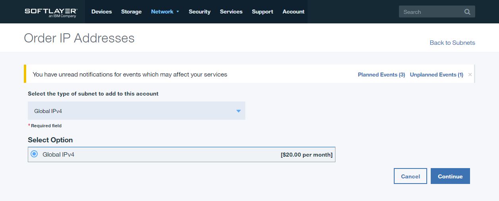

---

copyright:
  years: 1994, 2017-2019
lastupdated: "2019-02-28"

keywords: Global IP Addresses, Global IP address, single IP address

subcollection: subnets

---

{:shortdesc: .shortdesc}
{:new_window: target="_blank"}
{:DomainName: data-hd-keyref="DomainName"}
{:note: .note}
{:important: .important}
{:deprecated: .deprecated}
{:generic: data-hd-programlang="generic"}

# Informationen zu globalen IP-Adressen
{:#about-global-ip-address}

Eine globale IP-Adresse ist ein spezialisiertes, statisches, sekundäres Teilnetz. Es wird als /32-Teilnetz bereitgestellt (als eine einzelne IP-Adresse), die zu jeder weiteren IP-Adresse in Ihrem Kontos weitergeleitet werden kann. Sowohl IPv4- als auch IPv6-Adressen sind verfügbar; jeder Typ muss an eine IP-Adresse derselben IP-Version weitergeleitet werden. Zu den zulässigen Routing-Zielen gehören die von Ihren Servern verwendeten primäre IP-Adressen und alle portierbaren sekundären IP-Teilnetzadressen. Globale IP-Adressen weisen die folgenden speziellen Funktionen auf:

  * Bedarfsgesteuertes globales Routing zu IP-Adressen für ein Konto.
  * Die Adresse wird im Internet von allen {{site.data.keyword.cloud}}-Edge-Routern bekannt gegeben. Daher wird von Ihren Daten der kürzeste Weg zum {{site.data.keyword.cloud}}-Netz verwendet und von dort aus können Sie den dedizierten globalen {{site.data.keyword.cloud}}-Backbone verwenden, um das konfigurierte Ziel zu erreichen.

Globale IP-Adressen bieten eine hohe Flexibilität. Mit ihnen können Sie Workloads zwischen Servern verschieben, sogar in geografisch voneinander entfernte Rechenzentren. Darüber hinaus bieten globale IP-Adressen eine IP-Persistenz, da sie Änderungen ohne weitere Anpassungen ermöglichen (zum Beispiel zur Vermeidung von DNS-Caches). Die globale Routing-Funktion eignet sich hervorragend zum Übertragen von Workloads zu Disaster-Recovery-Sites oder für eine nahtlose Übertragung in eine neue Bereitstellung in einer geografischen Region, die für Ihre Zielgruppe besser geeignet ist.

| **Verfügbarkeit** | IPv4 | IPv6 |
| ---------------- | :--: | :--: |
| Öffentlliches Netz | Ja | Ja |
| Privates Netz      |      |      |

## Globale IP-Adressen verwalten
{:#manage-global-ip-address}

Führen Sie die folgenden Schritte aus, um globale IP-Adressen zu verwalten:

 1. Öffnen Sie in Ihrem Browser das [Kundenportal ](https://{DomainName}/){: new_window} und melden Sie sich bei Ihrem Konto an.
 1. Wählen Sie in der Navigation im Kundenportal **Klassische Infrastruktur** aus.
 1. Wählen Sie im Navigationsmenü 'Klassische Infrastruktur' **Netz > IP-Verwaltung > Globale IP** aus.
 1. Daraufhin werden die globalen IP-Adressen aufgelistet. Verwenden Sie Filter, um die Suche bei Bedarf einzugrenzen. 
 
Es kann vorkommen, dass einige Einträge keinen Wert für **Ziel** aufweisen; dies bedeutet, dass die globale IP-Adresse derzeit nicht weitergeleitet wird, also nicht in Betrieb ist.

### Adressen weiterleiten und die Weiterleitung von Adressen aufheben
{:#route-unroute-address}

Sobald Sie die gewünschte globale IP-Adresse gefunden haben, klicken Sie auf die zugehörige Teilnetz-ID. Als Nächstes sehen Sie eine Anzeige, in der das aktuelle Routenziel dargestellt wird (sofern zutreffend). Zum Weiterleiten (Senden von Datenverkehr) an ein neues Ziel stehen zwei Optionen zur Auswahl:

 * Die vollständige IP-Adresse eingeben
 * Mit dem Eingeben eines Hostnamens beginnen
 
Wenn Sie einen Hostnamen eingeben, können Sie nach dem Hostnamen eines Servers suchen und so seine IP-Adresse ermitteln. Nachdem Sie eine IP-Adresse eingegeben haben, wählen Sie **Aktualisieren** aus. Wenn Sie eine Weiterleitung für eine globale IP-Adresse aufheben möchten, wählen Sie **Löschen** aus. Wenn der Eingabestatus zu 'Ohne Weiterleitung' wechselt, wählen Sie **Aktualisieren** aus.

Im Dropdown-Menü wird keine vollständige Liste der verfügbaren IP-Adressen angezeigt. Geben Sie die gewünschte IP-Adresse manuell ein, wenn sie nicht in der Auswahlliste enthalten ist.
{:note}

### Wie oft kann eine Aktualisierung durchgeführt werden?
{:#how-often-can-i-update}

Es kann nur eine Aktualisierung für eine Weiterleitung gleichzeitig ausgeführt werden. Wenn Sie versuchen, die Route einer globalen IP-Adresse zu aktualisieren, während eine weitere Aktualisierung ausgeführt wird, tritt ein Fehler auf. Warten Sie, bis die vorherige Aktualisierung abgeschlossen ist, bevor Sie es erneut versuchen.

## Vorgehensweise zum Bestellen globaler IP-Adressen
{:#how-to-order-global-ip-address}

Führen Sie die folgenden Anweisungen aus, um globale IP-Adresse zu bestellen:

  1. Öffnen Sie in Ihrem Browser das [Kundenportal ](https://{DomainName}/){: new_window} und melden Sie sich bei Ihrem Konto an.
  1. Wählen Sie in der Navigation im Kundenportal **Klassische Infrastruktur** aus.
  1. Wählen Sie im Navigationsmenü 'Klassische Infrastruktur' **Netz > IP-Verwaltung > Globale IP** aus.
  3. Klicken Sie auf den Link **Neue IP-Adressen**.
  4. Wählen Sie im Dropdown-Menü nach Bedarf **Globale IPv4** oder **Globale IPv6** aus und klicken Sie auf **Weiter**, um den Bestellablauf zu starten.

### Nächste Schritte
{:#global-ip-address-next}

Falls keine Freigabeprozesse für Ihren Kontostatus erforderlich sind, wird in wenigen Momenten ein neues Teilnetz mit globalen IP-Adressen für Ihr Konto angezeigt.

### Ressourcengrenze
{:#global-ip-resource-limit}

Ein Konto kann nur über fünf (5) globale IP-Adressen pro IP-Version verfügen. Beispiel: Fünf (5) globale IPv4-IP-Adressen und fünf (5) globale IPv6-IP-Adressen.

## Vorgehensweise zum Stornieren globaler IP-Adresse
{:#how-to-cancel-global-ip-address}

Wenn Sie eine globale IP-Adresse nicht mehr benötigen, führen Sie die folgenden Schritte aus, um sie zu stornieren:

  1. Öffnen Sie in Ihrem Browser das [Kundenportal ](https://{DomainName}/){: new_window} und melden Sie sich bei Ihrem Konto an.
  1. Wählen Sie in der Navigation im Kundenportal **Klassische Infrastruktur** aus.
  1. Wählen Sie im Navigationsmenü 'Klassische Infrastruktur' **Netz > IP-Verwaltung > Globale IP** aus.
  1. Suchen Sie die gewünschte Adresse mit den jeweils erforderlichen Filtern.
  1. Rechts neben dem Eintrag der Adresse in der Adressliste wird ein Kreis mit einem X angezeigt. Klicken Sie auf dieses Symbol, um den Stornierungsprozess einzuleiten.
