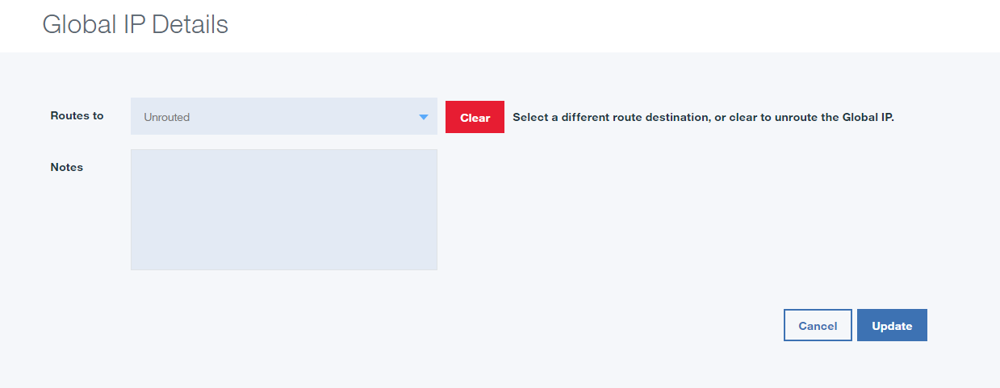

---
copyright:
  years: 1994, 2017
lastupdated: "2017-12-27"
---

{:shortdesc: .shortdesc}
{:new_window: target="_blank"}

# Globale IP-Adressen verwalten

Sie können Ihre globalen IP-Adressen in der Anzeige **Teilnetze** verwalten. 

1. Öffnen Sie in Ihrem Browser das [Kundenportal ](https://control.softlayer.com/){: new_window} und melden Sie sich bei Ihrem Konto an.
2. Wählen Sie in der Navigation des Kundenportals die Optionen für **Netz > IP-Verwaltung > Teilnetze** aus.
3. Wählen Sie im Dropdown-Menü **Globale IPv4** (oder IPv6) aus, um die Teilnetzliste so zu filtern, dass nur die globalen IPs angezeigt werden.
4. Klicken Sie auf die globale IP, die Sie verwalten möchten.
 
  **Anmerkung: Eine globale IP ist eine statische IP-Adresse, die an jeden Server innerhalb des IBM Cloud-Netzes weitergeleitet werden kann. Die zurzeit angebotene statische IP-Adresse kann nur an eine IP-Adresse innerhalb desselben Rechenzentrums weitergeleitet werden. Diese Einschränkung gilt nicht für globale IP-Adressen.**

5. Auf der Verwaltungsseite für IP-Adressen geben Sie die IP-Adresse des Servers, an den Sie die globale IP-Adresse weiterleiten möchten, sowie ggf. weitere Anmerkungen ein. Anschließend wählen Sie **Aktualisieren** aus.



## Ihrem Server eine globale IP hinzufügen 

Ihr Server akzeptiert erst dann Datenverkehr für die globale IP, wenn diese IP dem System ordnungsgemäß hinzugefügt wurde. Die für jedes System erforderlichen Befehle unterscheiden sich leicht, daher sind sie in den folgenden Abschnitten dargestellt.

### Für Linux-Server:

**Red Hat/CentOS**

1. Bearbeiten Sie (mit vim oder nano) die Datei `/etc/sysconfig/network-scripts/ifcfg-eth1:1`.

* Fügen Sie die folgenden Zeilen hinzu:
```
      DEVICE=eth1
      IPADDR=[globale IP-Adresse]
      NETMASK=255.255.255.255
      NETWORK=[Netz des primären IP-Blocks]
      ONBOOT=yes
```

**Debian/Ubuntu**

1. Bearbeiten Sie `/etc/network/interfaces`.

* Fügen Sie die folgenden Zeilen hinzu:

```
      post-up ip addr add [globale IP-Adresse]/32 dev eth1
      post-down ip addr del [globale IP-Adresse]/32 dev eth1
```

Wenn Ihr System nicht ordnungsgemäß funktioniert, fügen Sie stattdessen die folgenden Zeilen hinzu und ersetzen das Nummernzeichen (#) durch die nächste verfügbare Nummer:

```
        auto eth1:#

        iface eth1:# inet static

        address [globale IP-Adresse]

        netmask 255.255.255.255

        gateway [primäres öffentliches Gateway des Servers]
```

### Für Windows-Server

1. Navigieren Sie zu **Start -> Systemsteuerung -> Netzwerkverbindungen -> LAN-Verbindung (public) (Eigenschaften)**.
* Wählen Sie **Internetprotokoll (TCP/IP)** aus und klicken Sie auf **Eigenschaften -> Erweitert**.
* Wählen Sie im Abschnitt für IP-Adressen **Hinzufügen** aus und geben Sie die IP-Adresse und Teilnetzmaske ein.
* Wenn Sie fertig sind, klicken Sie mehrfach auf "OK", bis der Desktop wieder angezeigt wird.

Für die Überprüfung, ob Ihre Einstellungen wirksam sind, öffnen Sie eine DOS-Eingabeaufforderung, indem Sie **Start -> Ausführen -> "cmd"** auswählen/eingeben. Führen Sie dann den folgenden Befehl aus:

```
        > ipconfig /all
```

**Anmerkungen:**

* Wenn auf Ihrem Server bereits die im obigen Beispiel angegebene Datei `eth1:1` vorhanden ist, erhöhen Sie die letzte Ziffer auf die nächste verfügbare Ganzzahl.
* Es kann bis zu fünf Minuten dauern, bis die Änderung einer globalen IP-Adresse für einen neuen Server oder eine neue VSI wirksam wird. 
* Innerhalb des IBM Cloud-Netzes dauert die Routenaktualisierung weniger als 1 Minute.
* Globale IPs funktionieren nicht bei lokalen Lastausgleichsfunktionen.
* Globale IPs werden aus einem eindeutigen Teilnetz verteilt; es ist nicht möglich, vorhandene Kunden-IPs zu konvertieren oder als globale IPs zu verwenden.
* Globale IPs alleine sind keine automatische Funktionsübernahmelösung, da keine Statusprüfungen ausgeführt werden. Eine globale IP-Adresse kann jedoch als Komponente einer Funktionsübernahmeumgebung verwendet werden, wenn Sie die DNS-Weitergabe umgehen möchten.
